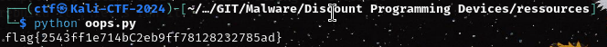

# Discount Programming Devices


## Ressources :
- oops.py

### Keyword : "obfuscate"

first line of the python file is : 
```
_ = lambda __ : __import__('zlib').decompress(__import__('base64').b64decode(__[::-1]));exec((_)(b'==gP54lIP4///+M/1+GMvNce/fWcVLH[...]
```
where lamba is a function.
What this will do is take a base64 string , read it from the end
so "ABCD" become "DCBA" then using the zlib library decompress it and finally execute it using exec() 
since we dont want to run it , well replace exec with print() as such :
```
_ = lambda __ : __import__('zlib').decompress(__import__('base64').b64decode(__[::-1]));print((_)
```

another exec one strange right.
At that point you have two choices :
1 : I trust the CTF admins or i can nuke the VM , let's run the script.
2 : Let's do static 

in our case static mean repete the print() decode decompress operation until we find a string of interest
the second : i'm on a nukable VM meaning i can just rebuild it , let's run it : 



Indeed running it was the good solution : 
flag{2543ff1e714bC2eb9ff78128232785ad}

##Disclaimer: 
###Please , Don't run any malware files on your work computer
