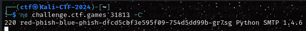

# Red Phish Blue Phish


## Ressources :
- A Webserver to communicate

### Keyword : "as a user susceptible to phishing."
Our goal ? Make Sarah take the bait 

Browse the web a bit while searching for the domain "pyrchdata.com" and you'll find :
```https://pyrchdata.com/
```

Remember the first goal of phishing is to make it look real so head to "Meet the Team"
From there we have a nice group of target for our operation


Then a quick NC to the given address reveal a smtp server:



for our purpose we'll use telnet.
from there using this message : 


Sarah was kind enough to give us the flag.
flag{54c6ec05ca19565754351b7fcf9c03b2}
