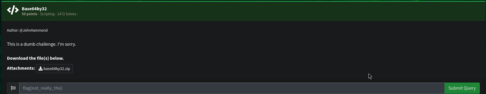
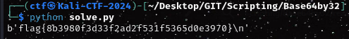

# Base64by32


## Ressources :
- Base64by32.zip
  
### Keyword : The Name Base64 by32

After extracting the ZIP file , we obtain a file named base64by32

open it and the first few lines are : 
```
Vm0wd2QyUXlVWGxWV0d4V1YwZDRWMVl3WkRSV01WbDNXa1JTVjAxV2JETlhhMUpUVmpBeFYySkVU
bGhoTVVwVVZtcEJlRll5U2tWVQpiR2hvVFZWd1ZWWnRjRUpsUmxsNVUydFdWUXBpUjJodlZGWldk
```
So we got our "base64" only thing left is to decode the base64 (the whole file) 32 time. 
using python :
```
from base64 import b64decode

with open('./base64by32','r') as encoded:
	string = encoded.read()
	
for i in range(32):
	string = b64decode(string)
	
print(string)
```
Run the script :




flag{8b3980f3d33f2ad2f531f5365d0e3970}
