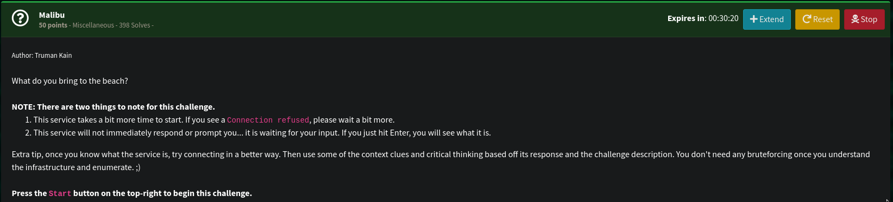
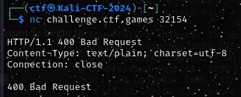
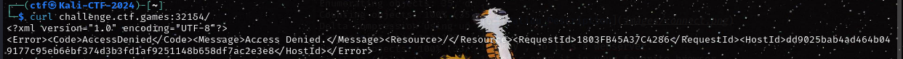
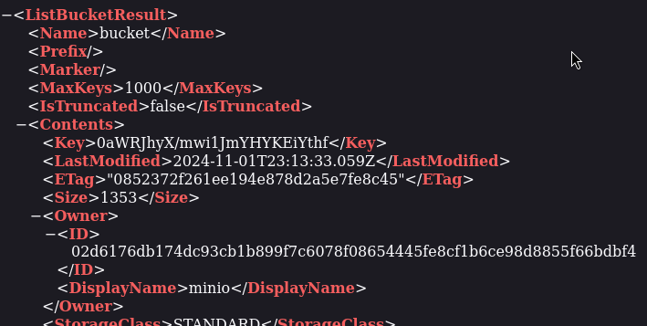
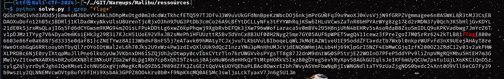

# Malibu


## Ressources :

```
nc challenge.ctf.games 32154
```

### Keyword : Malibu , Beach 


First thing we do let's recon a bit and try to connect to the provided address.



Okay , so it's a webserver.
let's open it in your favorite browser.


Strange that look strangely like an error message from an amazon bucket 
Bucket ? Malibu...Beach ... BUCKET ! 

With this new found idea let's try the /bucket endpoint:



Minio is used to store files on a remote instance. 
using a python script we will pull all of the object and check for any string of interest 
(the script is in /ressources/solve.py)



here's the flag :
flag{800e6603e86fe0a68875d3335e0daf81}
