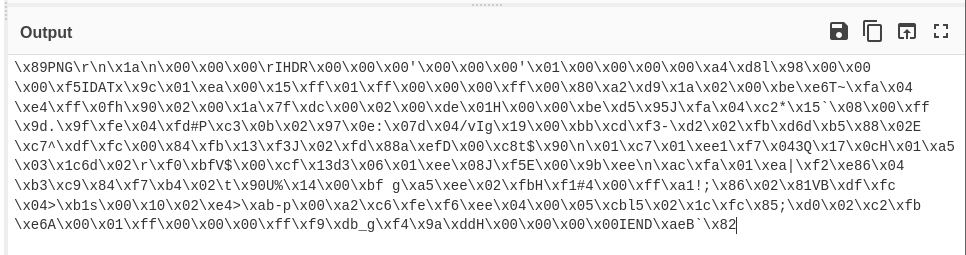
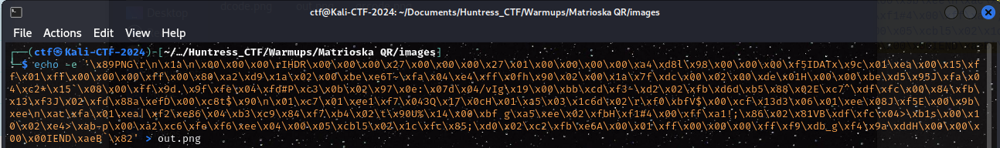

#MatrioskaQR

##Keyword : The Name MatrioskaQR

##Ressources :
- a QRCode

-A Matrioska is a doll inside another doll
-> Perhaps something is hidden in that qr let's decode it first 

Take the output and run echo -e to turn it into another QRCODE

You get : 

Decode the QR code once again and here's the flag:
flag{01c6e24c48f48856ee3adcca00f86e9b}
