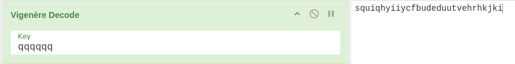
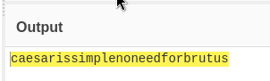

# No Need for brutus

## Ressources:

```
squiqhyiiycfbudeduutvehrhkjki 
```

### Keyword : "Brutus" 

Brutus -> Caesar 
_________________
Caesar -> Box cipher
       -> Vigenere



let cyberchef cook it:


From there take the md5() of the password 
add the flag{}.
and we get : flag{c945bb2173e7da5a292527bbbc825d3f}
