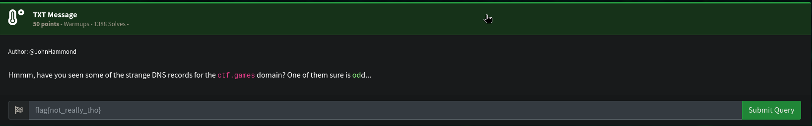
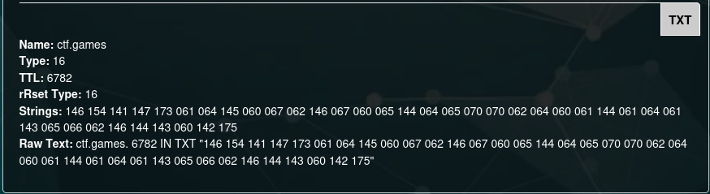
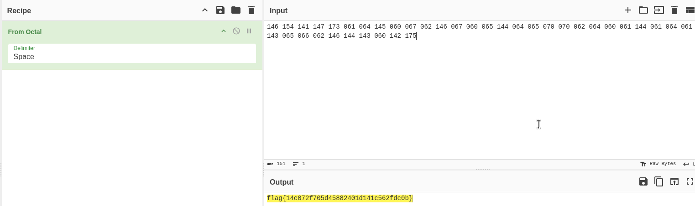

# Strange_Text


## Ressources :
- None

### Keyword : dns record

so let's check it we'll use : 
```
https://whoisfreaks.com/tools/dns/lookup/ctf.games
```


that's indeed a strange record 
let's take the strings and past it into cyberchef

After a bit of analysis our companion propose "From Octal" 
let's give it a go :



here's the flag : 
flag{14e072f705d45882401d141c562fdc0b}

