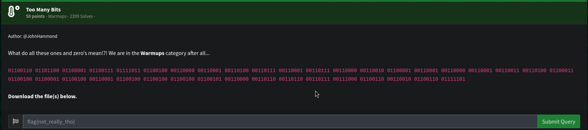

# Too Many Bits



## Ressources :
```
01100110 01101100 01100001 01100111 01111011 01100100 00110000 00110001 00110100 00110111 00110001 00110111 00110000 00110010 01100001 00110001 00110000 00110001 00110011 00110100 01100011 01100100 01100001 01100100 00110001 01100100 01100100 01100100 01100101 00110000 00110110 00110110 00110111 00111000 01100110 00110010 01100110 01111101
```

### Keyword : bits 

Bits (1) -> bytes(8)
Each block represent a number.
take the byte : "01100110" 
each bit has a value where :
```
 0   1  1  0 0 1 1 0
128 64 32 16 8 4 2 1
```
64 + 32 + 4 + 2 = 102
102 from decimal is the letter "f" 
reproduce for the whole message (or use Cyberchef)

and you get :
flag{d01471702a10134cdad1ddde06678f2f}

