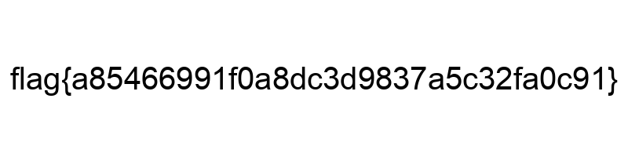

# Unbelievable

## Ressources:
- Half-Life_3_OST.mp3
###Keyword "Unbelievable" 
As said by the description let's not believe in the file type and check it's magic byte.

A bit strange for a .mp3 file to have a png magic byte.
if we rename to file .png instead of mp3 we get:

Giving us our flag.
