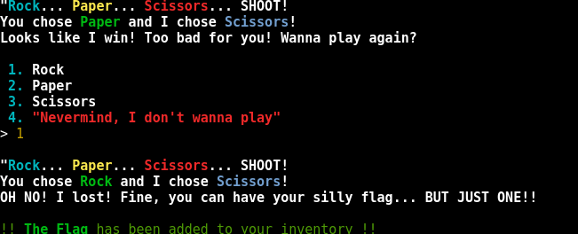

# Whamazon

## Ressources :
- Website

### Keyword : Whamazon + Can you buy a flag?  

Buy ? -> Overflow ? Negative check ? 
Let's test this right now:

Opening the link we find this beauty : 

So far nothing out the ordinary right , let's buy apples

but with a twist let's buy a negative amount of apple :

Seem like the programmer forgot to check that the number of apple was superior to 0 

try to buy the flag : 

and this kind gent want to play rock paper scissors fine by me.
i'll play rock.

once won -> "Nothing , I want to leave"
then -> Examine Your inventory 

And here's our flag : 
flag{18bdd83cee5690321bb14c70465d3408}

